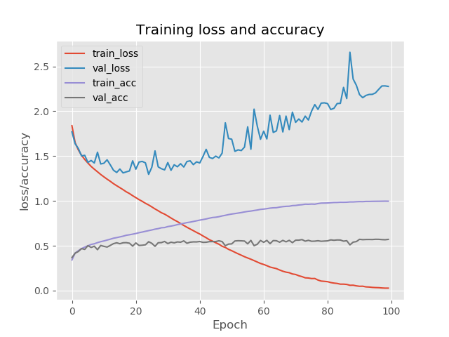
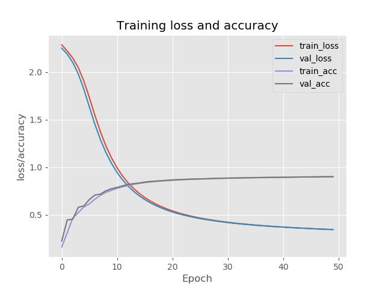

# Machine learning codes
This repository containd various machine learning codes starting from the basic perceptron network to advanced neural networks.  It also has the basic implementation of stochastic gradient method, and data pre-processors for different image datasets. The datasets used to train these models are:
* CIFAR-10 (https://www.cs.toronto.edu/~kriz/cifar.html).
* MNIST (http://yann.lecun.com/exdb/mnist/).

## Table of contents
* [General info](#general-info)
* [Technology](#Technology)
* [Output results](#output-results)

## General info
This is a simple modular python code repository for machine learning implementation especially neural networks. 
It covers the basic implementations of neural networks from scratch. Most of the codes were written, while studying and refering the following book- 
*  PyImage Book- (https://www.pyimagesearch.com/deep-learning-computer-vision-python-book/)

	
## Technology

Project is created with:
* Python: 2.x
* Scikit-learn
* Numpy
* Open-Cv2
* MatplotLib
	
## Output results

* CIFAR-10 dataset results

* MNIST dataset results

